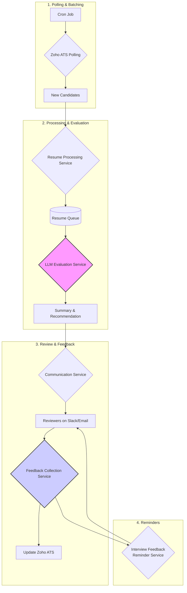

# System Architecture

## High-Level Flow

This diagram illustrates the high-level architecture of the Re:Crude platform, from polling for new candidates to updating their status in the ATS.

```mermaid
graph TD
    subgraph "1. Polling & Batching"
        A[Cron Job] --> B{Zoho ATS Polling};
        B --> C[New Candidates];
    end

    subgraph "2. Processing & Evaluation"
        C --> D{Resume Processing Service};
        D --> E[(Resume Queue)];
        E --> F{LLM Evaluation Service};
        F --> G[Summary & Recommendation];
    end

    subgraph "3. Review & Feedback"
        G --> H{Communication Service};
        H --> I[Reviewers on Slack/Email];
        I --> J{Feedback Collection Service};
        J --> K[Update Zoho ATS];
    end

    subgraph "4. Reminders"
        J --> L{Interview Feedback<br>Reminder Service};
        L --> I;
    end

    style F fill:#f9f,stroke:#333,stroke-width:2px
    style J fill:#ccf,stroke:#333,stroke-width:2px
```
