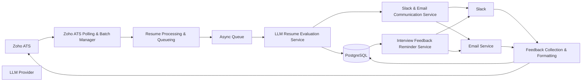

# System Architecture

This document describes the **high-level system architecture** of the Hiring Application (Re:Crude), outlining its components, data flow, and interactions between internal services and external integrations.

---

## 1. Architecture Overview

Re:Crude is an **event-driven, modular recruitment automation platform** that integrates:

- Zoho ATS as the system of record
- LLM-based services for resume and feedback evaluation
- Asynchronous processing using queues
- Slack and Email for reviewer communication

The architecture is designed for **scalability, traceability, and extensibility**, supporting high-volume hiring workflows with minimal manual intervention.

---

## 2. High-Level Architecture Diagram

---

## 3. Component Responsibilities

This section describes the core modules of the Hiring Application and their individual responsibilities within the recruitment workflow.

---

### Zoho ATS Polling & Batch Manager
- Periodically polls Zoho ATS using scheduled cron jobs.
- Identifies candidates in the following stages:
  - New
  - Applied
  - Custom screening required stages
- Creates batch execution records to support traceability and auditing.

---

### Resume Processing & Queueing Module
- Fetches resume links from storage systems such as S3 or Google Drive.
- Validates resume accessibility and file integrity.
- Pushes resume processing jobs into asynchronous queues.
- Supports parallel execution for high-volume resume processing.

---

### LLM Resume Evaluation Service
- Fetches resume content for processing.
- Injects job profile context into LLM prompts.
- Generates:
  - Structured resume summary (skills, experience, projects)
  - AI-based recommendation:
    - Selected
    - Not Selected
    - Needs Manual Review
- Persists evaluation results in the database.

---

### Slack & Email Communication Service
- Sends AI-generated resume summaries and recommendations to reviewers.
- Maintains Slack thread context per candidate.
- Captures reviewer interactions through:
  - Emoji reactions
  - Thread replies
  - Email responses

---

### Feedback Collection & Formatting Module
- Collects interviewer feedback from Slack and Email.
- Normalizes unstructured feedback into structured formats using LLM.
- Saves both raw and formatted feedback to:
  - Zoho ATS
  - Internal database
- Generates candidate-facing communication drafts.

---

### Interview Feedback Reminder Service
- Tracks pending interview feedback submissions.
- Sends scheduled reminders via Slack and Email.
- Ensures timely completion of interviewer feedback.

---
