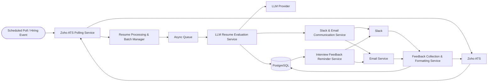

# System Architecture

This document describes the **high-level system architecture** of **Re:Crude**, outlining its components, execution flow, and interactions between internal services and external integrations.

---

## 1. Architecture Overview

Re:Crude is an **event-driven, modular recruitment automation platform** designed to automate resume screening, candidate evaluation, and interview feedback workflows.

The architecture is built around:

- A **scheduled or event-based trigger** to initiate hiring workflows  
- Zoho ATS as the **system of record**  
- Asynchronous processing using queues for scalability  
- LLM-based services for resume and feedback evaluation  
- Slack and Email for human-in-the-loop communication  

This design ensures **scalability, traceability, fault tolerance, and extensibility** across high-volume hiring scenarios.

---

## 2. High-Level Architecture Diagram

## 3. End-to-End Execution Flow

This section describes the complete execution flow of Re:Crude, starting from the system trigger and ending with feedback closure and reminders.

---

### Workflow Trigger
- The system is initiated by a **scheduled poll or hiring-related event**.
- This trigger activates the Zoho ATS Polling Service to begin candidate processing.

---

### Zoho ATS Polling Service
- Polls Zoho ATS at configured intervals.
- Fetches candidates in eligible stages, such as:
    - New
    - Applied
    - Custom screening stages
- Detects newly added or updated candidate records.
- Forwards eligible candidates to the Resume Processing & Batch Manager.

---

### Resume Processing & Batch Manager
- Retrieves resume metadata and file references from storage.
- Validates resume availability and file integrity.
- Groups candidates into execution batches.
- Pushes resume processing jobs into the asynchronous queue.

---

### Asynchronous Queue
- Acts as a buffer between ingestion and evaluation.
- Enables parallel and scalable resume processing.
- Supports retry mechanisms and failure isolation.

---

### LLM Resume Evaluation Service
- Consumes resume jobs from the queue.
- Fetches and preprocesses resume content.
- Enriches prompts with job descriptions and evaluation criteria.
- Invokes the external **LLM Provider** for analysis.
- Generates:
   - Structured resume summaries
   - Skill and experience extraction
   - AI-driven recommendations:
     - Selected
     - Not Selected
     - Needs Manual Review
- Persists evaluation results in the database.
- Triggers downstream communication workflows.

---

### Slack & Email Communication Service
- Sends AI-generated summaries and recommendations to reviewers.
- Maintains Slack thread context for each candidate.
- Captures reviewer interactions through:
  - Slack thread replies
  - Emoji reactions
  - Email responses

---

### Feedback Collection & Formatting Service
- Collects interviewer feedback from Slack and Email channels.
- Normalizes unstructured feedback into structured formats using LLMs.
- Stores both raw and formatted feedback in the database.
- Pushes finalized feedback and recommendations back to Zoho ATS.

---

### Interview Feedback Reminder Service
- Periodically queries the database for pending feedback.
- Identifies overdue or incomplete interview evaluations.
- Sends automated reminders via Slack and Email.
- Ensures timely completion of interview feedback.

---

## 4. Architectural Characteristics

- **Event-Driven** – Workflows are initiated by scheduled or system events  
- **Asynchronous** – Queue-based processing enables parallel execution  
- **Modular** – Services have clear, single responsibilities  
- **Fault-Tolerant** – Failures are isolated and retryable  
- **Human-in-the-Loop** – AI assists decision-making without replacing human judgment  

